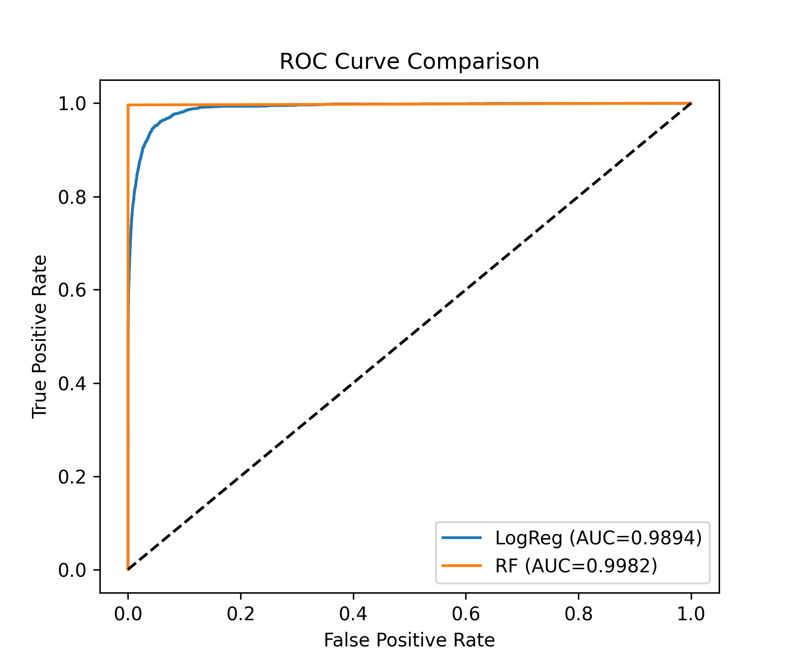
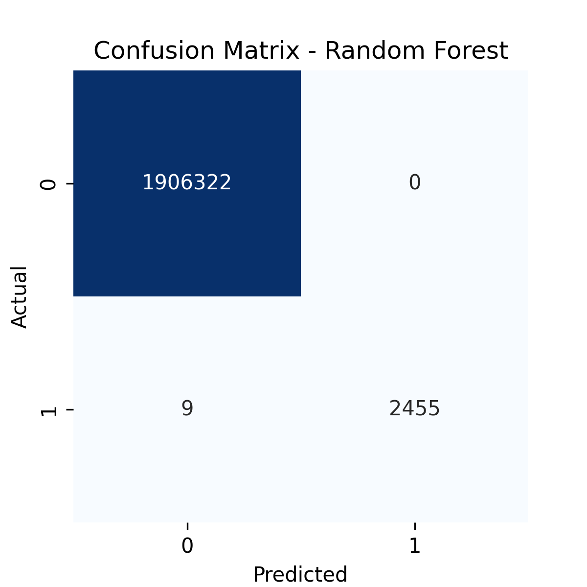

# fraud-detection-ml
"Machine Learning project to detect fraudulent financial transactions using Python and scikit-learn"
# Fraud Detection Using Machine Learning

## 📌 Overview
This project builds a **machine learning model** to detect fraudulent financial transactions.  
The dataset contains over **6 million records**, each representing a transaction with details like transaction type, amount, account balances, and whether it was fraudulent.

The aim is to:
1. Detect fraudulent transactions using ML models
2. Identify key factors behind fraud
3. Recommend prevention measures for businesses

---

## 📂 Dataset
- **Source:** Provided CSV file (`fraud.csv`)
- **Target Variable:** `isFraud` (1 = Fraud, 0 = Not Fraud)
- **Main Features:**
  - `type` → Transaction type (CASH-IN, CASH-OUT, DEBIT, PAYMENT, TRANSFER)
  - `amount` → Transaction amount
  - `oldbalanceOrg`, `newbalanceOrig` → Sender's balances before/after transaction
  - `oldbalanceDest`, `newbalanceDest` → Receiver's balances before/after transaction
  - `isFlaggedFraud` → Business rule flag for very large transfers

---

## 🛠️ Steps Performed

### 1️⃣ Data Cleaning
- Dropped identifiers (`nameOrig`, `nameDest`)
- Kept merchant-related missing values as they are intentional in the dataset
- Checked for outliers and multicollinearity

### 2️⃣ Feature Engineering
- One-hot encoded transaction type (`type`)
- Created:
  - `balanceDiffOrig` → Change in sender’s balance minus transaction amount
  - `balanceDiffDest` → Change in receiver’s balance minus transaction amount
- Scaled numeric features

### 3️⃣ Model Building
- **Models Used:**
  - Logistic Regression (baseline)
  - Random Forest Classifier (final choice)
- Handled class imbalance using `class_weight='balanced'`
- Train-test split: 70%-30% with stratification

### 4️⃣ Model Evaluation
- Metrics: Precision, Recall, F1-Score, ROC-AUC
- Plotted ROC curves for both models
- Random Forest showed higher recall and ROC-AUC, making it the better choice

### 5️⃣ Insights
- Fraud often happens in `TRANSFER` and `CASH_OUT` transactions
- High transaction amounts are more likely to be fraudulent
- Sudden balance drops in sender accounts are strong fraud indicators

### 6️⃣ Recommendations
- Real-time monitoring of high-value transfers
- Transaction velocity checks to catch rapid multiple transfers
- Alerts for sudden large balance drops
- Strong verification for suspicious destination accounts

### 7️⃣ Measuring Effectiveness
- Track fraud rate reduction
- Monitor false positive rates
- Compare monetary loss before/after implementation
- Conduct A/B testing

---

## 📊 Results
| Model               | Precision | Recall | F1-Score | ROC-AUC            |
|---------------------|-----------|--------|----------|--------------------|
| Logistic Regression | 0.9999    |0.9509  | 0.9748   | 0.9893712941489136 |
| Random Forest       | 1.0000    |0.9982  |  0.9991  |  0.9981726465163141|


---

## 📸 Sample Output

### ROC Curve


### Confusion Matrix (Random Forest)


---

## 🚀 Tech Stack
- **Language:** Python
- **Libraries:** pandas, numpy, matplotlib, seaborn, scikit-learn
- **Algorithms:** Logistic Regression, Random Forest
- **Other:** Feature Engineering, Class Imbalance Handling, Exploratory Data Analysis

---

## 📜 How to Run
1. Clone this repository:
   ```bash
   git clone https://github.com/mohanSai0706/fraud-detection-ml.git
   cd fraud-detection-ml
2. Place fraud.csv in the project folder.
3. Open and run the notebook:
      jupyter notebook fraud_detection.ipynb
4. Run cells in order to reproduce results.

# 📂 Project Folder Structure - Fraud Detection ML

│
├── fraud_detection.ipynb # Main Jupyter Notebook with code & analysis
├── README.md # Project documentation
│
├── data/ # Dataset storage
│ └── fraud.csv # Raw dataset (not committed if too large)
│
├── images/ # Generated plots & visuals
│ ├── roc_curve.png # ROC Curve plot
│ └── confusion_matrix.png # Confusion Matrix heatmap
│
├── models/ # Saved ML models
│ ├── rf_fraud_model.pkl # Trained Random Forest model
│ └── logreg_fraud_model.pkl # Trained Logistic Regression model
│
└── requirements.txt # List of Python dependencies


